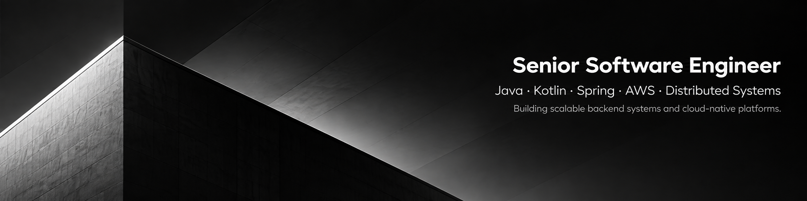

  

# I’m Juliano

**Senior Software Engineer & DevOps Practitioner** — building reliable, scalable backend systems and cloud infrastructure.

## What I Do
- Backend development using **Kotlin** / **Java** + **Spring Boot**  
- DevOps & Cloud: **AWS**, CI/CD, monitoring, infrastructure as code  
- Data transformation, JSON processing, API integrations  
- Distributed systems, microservices & scalable architectures  

## 🛠️ Tech Stack
`Kotlin · Java · Go · Rust · Spring Boot · AWS · Docker · Kubernetes · Terraform · JSON · REST · Microservices · CI/CD · Monitoring`

## 📫 Get in Touch
-  [LinkedIn](https://www.linkedin.com/in/julianosena/)  
- 📧 Email: julianossc@gmail.com  
-  Portfolio / Blog: [julianosena.com](https://julianosena.com)  <!-- optional -->

> “I value honesty, integrity, and prioritizing solving clients’ problems over maximizing profit.”  
